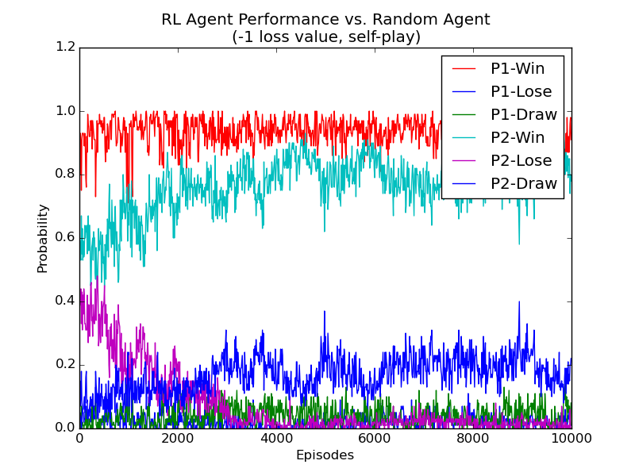

# Reinforcement Learning in 3x3 Tic-Tac-Toe, *learning by random self-playing*
> Implementation in Python (2 or 3), forked from [tansey/rl-tictactoe](https://github.com/tansey/rl-tictactoe).

A quick Python implementation of the **3x3** [Tic-Tac-Toe](https://en.wikipedia.org/wiki/Tic-Tac-Toe) **value function learning agent**, as described in Chapter 1 of
[*"Reinforcement Learning: An Introduction"* by Sutton and Barto](http://webdocs.cs.ualberta.ca/~sutton/book/the-book.html) :book:.

----

### Usage of this program :memo:
This implementation is simply [one Python file (``tictactoe.py``)](./tictactoe.py):

```bash
# Run this program and keep its output
python2 tictactoe.py | tee ./tictactoe.log
```

The code is [pylint-valid](https://www.pylint.org/) with both Python 2 and 3 (2.7+ and 3.4+).

### Example :muscle:
See the figure below for an example of what is achieved with this rather simple implementation:


Numerical results are also available in the (long) [results.csv](./results.csv) CSV file.

### Limitation :dizzy:
> - Only 3 by 3 (3x3) Tic-Tac-Toe is implemented.
> - [See this other project for a higher-dimensional Tic-Tac-Toe](http://naereen.github.io/Pengkun--Master-Thesis--2015/).

----

### Explanations :thumbsup:
The agent contains a lookup table that maps states to values, where initial values are 1 for a win, 0 for a draw or loss, and 0.5 otherwise.
At every move, the agent chooses either the maximum-value move (greedy) or, with some probability epsilon, a random move (exploratory); by default ``epsilon=0.1``.

The agent updates its value function (the lookup table) after every greedy move, following the equation:

```
V(s) <- V(s) + alpha * ( V(s') - V(s) )
```

#### Why? :boom:
This particular implementation addresses the question posed in Exercise 1.1:

> *What would happen if the RL agent taught itself via self-play?*

The result is that the agent learns only how to maximize its own potential payoff,
without consideration for whether it is playing to a win or a draw.
Even more to the point, the agent learns a myopic strategy where it basically has a single path that it wants to take to reach a winning state.

If the path is blocked by the opponent, the values will then usually all become 0.5 and the player is effectively moving randomly (so we did nothing clever in this case).

Note that if you use a loss value of -1, then the agent learns to play the optimal strategy in the minimax sense.

----

### :scroll: License and authors
- Forked and cleaned up by [Lilian Besson (Naereen)](https://github.com/Naereen), 28/12/2015, for [my MVA master project for the "Reinforcement Learning" course](https://bitbucket.org/lbesson/mva15-project-graph-reinforcement-learning/).
- Created by [Wesley Tansey](https://github.com/tansey/), 1/21/2013.
- Code released under the [MIT license](http://lbesson.mit-license.org).

[](https://github.com/Naereen/Wesley-Tansey-RL-TicTacToe/)
